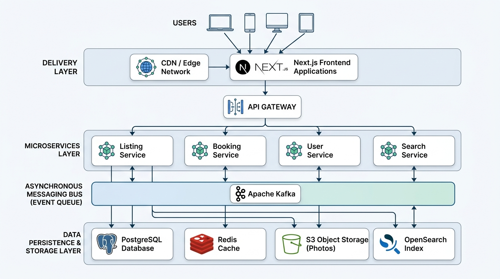

# Airbnb Clone

A desktop-first, pixel-perfect recreation of the authentic Airbnb listing experience, featuring a complete Listing Page, full-screen Photo Tour, accessible keyboard-navigable Lightbox, dynamic pricing calculation, and comprehensive test coverage.



---

## Overview

This application is built as an AI-native take-home implementation replicating the visual fidelity, subtle micro-interactions, responsive desktop constraints, and strict accessibility standards of Airbnb. The application is completely frontend-driven, leveraging high-resolution imagery and local static data.

---

## Features

### 1. Listing Page
- **Navigation Header**: Airbnb brand logo, center search pill (`Anywhere · Any week · Add guests`), and interactive user profile menu with dropdown.
- **Listing Title & Social Actions**: High-contrast title typography, superhost badge, review score, location link, and interactive **Share** (with clipboard copy notification) and **Save** (animated heart toggle).
- **Hero Image Gallery**: 5-image grid layout (large 2-column anchor on left, 2x2 grid on right) with subtle hover brightness transitions and a floating **"Show all photos"** trigger.
- **Host & Property Highlights**: Host avatar, Superhost status badge, Guest Favorite banner, fast wifi perk, self check-in smart lock, and free cancellation badge.
- **Space & Description**: Multi-paragraph property description with an accessible **"Show more"** modal dialog.
- **Sleeping Arrangements**: Card-based visual preview of all 4 bedrooms and bed configurations.
- **Amenities**: 2-column grid of top amenities with icons and a **"Show all 16 amenities"** modal categorizing amenities by room/facility.
- **Reviews & Ratings**: 6-factor ratings breakdown (Cleanliness, Accuracy, Communication, Location, Check-in, Value) with progress bars and verified guest reviews.
- **Location & Neighborhood**: Map preview card with custom pulse pin and neighborhood details.
- **Meet your Host**: Host details card with stats, bio, response times, and **"Message Host"** modal.
- **Sticky Booking Card**:
  - Dynamic nightly rate calculation based on check-in and checkout dates.
  - Interactive Guest counter dropdown (Adults, Children, Infants).
  - Airbnb signature radial gradient **Reserve** button.
  - Transparent itemized price breakdown (nightly subtotal, cleaning fee, service fee, and total).
- **Footer**: Standard Airbnb desktop multi-column footer with language, currency, and legal links.

### 2. Photo Tour
- Full-screen modal overlay triggered by "Show all photos" or clicking hero grid photos.
- Sticky navigation header with back/close button, Share, and Save actions.
- Category filter navigation pills (*All photos*, *Living room*, *Bedrooms*, *Kitchen*, *Exterior & Pool*, *Bathrooms*).
- High-res categorized photo cards with captions.
- Seamless trigger to open the single-photo Lightbox for any selected photo.

### 3. Lightbox (Single Photo Viewer)
- Centered full-screen single-image viewer with dark backdrop.
- Previous (`<`) and Next (`>`) floating circular navigation controls.
- Real-time photo counter (`X / 15`) and category pill badge.
- **Keyboard Navigation**:
  - `ArrowRight`: Navigate to next image
  - `ArrowLeft`: Navigate to previous image
  - `Escape`: Close lightbox
  - `Tab / Shift+Tab`: Trap focus within dialog
- **Focus Management**: Focus automatically moves into the dialog upon opening and restores to the triggering element upon close.
- Semantic ARIA attributes (`role="dialog"`, `aria-modal="true"`, `aria-label="Photo Lightbox"`).

---

## Tech Stack

- **Framework**: [Next.js](https://nextjs.org/) (App Router, React 18/19)
- **Language**: [TypeScript](https://www.typescriptlang.org/) (Strict Mode)
- **Styling**: [Tailwind CSS](https://tailwindcss.com/) with custom Airbnb tokens
- **Icons**: [Lucide React](https://lucide.dev/)
- **Testing**: [Playwright](https://playwright.dev/) for End-to-End browser testing

---

## Project Structure

```text
airbnb-clone/
├── .agents/                        # AI Agent workflow & configuration files
│   ├── frontend-agent.md
│   ├── visual-qa-agent.md
│   └── a11y-qa-agent.md
├── architecture/                   # Production system design & diagrams
│   ├── architecture.png            # Visual architecture diagram
│   └── architecture.md             # Scalability & cloud infrastructure specification
├── prompts/                        # AI prompt history & sequence
│   └── development-prompts.md
├── src/
│   ├── app/
│   │   ├── globals.css             # Tailwind base styles, scrollbars, gradients
│   │   ├── layout.tsx              # Root HTML layout and metadata
│   │   └── page.tsx                # Main listing page assembly
│   ├── components/
│   │   ├── BookingCard/            # Sticky reservation card widget
│   │   │   └── BookingCard.tsx
│   │   ├── Footer/                 # Desktop footer
│   │   │   └── Footer.tsx
│   │   ├── Header/                 # Navigation bar and user dropdown
│   │   │   └── Header.tsx
│   │   ├── Lightbox/               # Accessible single-image modal viewer
│   │   │   └── Lightbox.tsx
│   │   ├── Listing/                # Listing content sections
│   │   │   ├── AmenitiesSection.tsx
│   │   │   ├── HeroGallery.tsx
│   │   │   ├── HostInfo.tsx
│   │   │   ├── HostProfileSection.tsx
│   │   │   ├── ListingDescription.tsx
│   │   │   ├── ListingHighlights.tsx
│   │   │   ├── ListingTitle.tsx
│   │   │   ├── LocationSection.tsx
│   │   │   ├── ReviewsSection.tsx
│   │   │   └── SleepingArrangements.tsx
│   │   └── PhotoTour/              # Fullscreen categorized photo tour
│   │       └── PhotoTour.tsx
│   ├── data/
│   │   └── listing.ts              # Local static listing data model
│   └── hooks/
│       └── useLightbox.ts          # Lightbox state management hook
├── tests/
│   └── listing.spec.ts             # Playwright test suite (10 test cases)
├── next.config.mjs
├── package.json
├── playwright.config.ts
├── tailwind.config.ts
├── tsconfig.json
└── README.md
```

---

## Running Locally

### Prerequisites
- Node.js 18+ or 20+
- npm, pnpm, or yarn

### Installation
```bash
# Clone or navigate to the directory
cd "AirBnb Clone"

# Install dependencies
npm install
```

### Development Server
```bash
npm run dev
```
Open [http://localhost:3000](http://localhost:3000) in your desktop browser.

### Production Build
```bash
npm run build
npm run start
```

---

## Testing

Run the automated Playwright test suite:
```bash
npx playwright test
```

### Test Coverage Highlights
1. Initial page load & component visibility (Header, Gallery, Reservation Widget).
2. "Show all photos" trigger opening Photo Tour.
3. Hero photo click opening Lightbox with correct index.
4. Next / Previous buttons image advancement.
5. Keyboard `ArrowRight` / `ArrowLeft` navigation.
6. Keyboard `Escape` closing Lightbox.
7. Close button click and focus restoration.
8. Photo Tour selecting an image opens Lightbox directly.

---

## AI Development Workflow

This project was developed using a structured 4-agent AI workflow:
1. **Agent 1 (Reference Analysis)**: Audited reference UI, spacing tokens, and modal interactions to establish a comprehensive technical plan.
2. **Agent 2 (Frontend Implementation)**: Built typed components, hooks, and responsive layouts adhering to Airbnb design tokens.
3. **Agent 3 (Visual QA)**: Inspected component alignments, border radiuses, gradients, and micro-interactions.
4. **Agent 4 (Accessibility & Interaction QA)**: Verified WCAG 2.1 AA dialog semantics, keyboard shortcuts (`ArrowLeft`, `ArrowRight`, `Escape`, `Tab`), and focus retention.

Detailed prompts are documented in [`prompts/development-prompts.md`](prompts/development-prompts.md) and agent configs are located in [`.agents/`](.agents/).

---

## Architecture

A conceptual production-scale architecture for a high-traffic vacation-rental marketplace is detailed in [`architecture/architecture.md`](architecture/architecture.md) and depicted in [`architecture/architecture.png`](architecture/architecture.png).

- **Frontend & Edge Tier**: Cloudflare CDN + Next.js SSR / ISR.
- **Gateway & Services**: API Gateway, Listing Service, Booking & Payment Service, User Service, Search Service.
- **Event Streaming**: Apache Kafka for asynchronous order/review processing.
- **Storage**: PostgreSQL (Transactional), Redis (Cache & Session Locks), S3 (Media), OpenSearch (Geospatial & Faceted search).

---

## Important Implementation Decisions

1. **Local State vs. Global Stores**: Kept state localized using standard React hooks (`useLightbox`, component state) to eliminate unnecessary bundle bloat.
2. **Zero External CSS Frameworks beyond Tailwind**: Pure Tailwind CSS utilities and custom tokens ensure maximum rendering performance and zero layout shift.
3. **Focus Retention Pattern**: Lightbox captures the invoking element reference on open and cleanly restores focus on close, preventing screen reader disorientations.
4. **Optimized Next.js Images**: Configured remote pattern domains with fill layouts and responsive sizing parameters.

---

## Known Limitations

- **Desktop-Focused**: Optimized for desktop viewport resolutions (1024px to 1920px+); full mobile navigation bar is omitted per specification.
- **Static Map**: The map section displays an interactive stylized vector map card with accurate coordinates rather than a paid third-party Mapbox/Google Maps API key.
