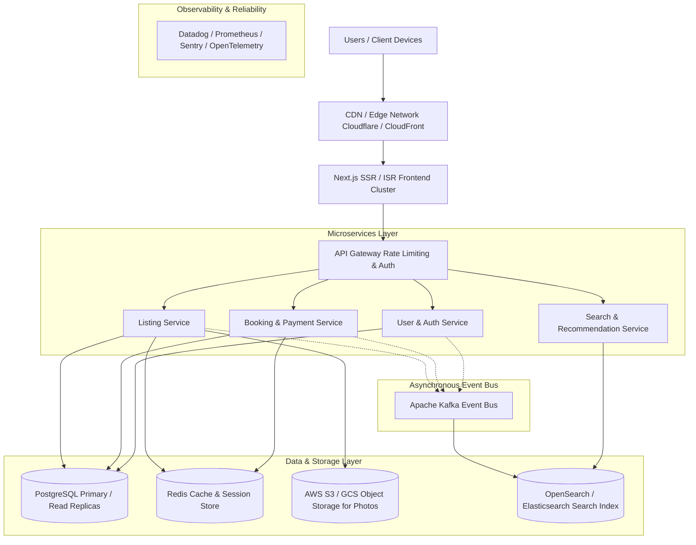

# Production-Scale Vacation-Rental Marketplace Architecture

This document describes the conceptual architecture designed for a resilient, high-throughput, multi-region vacation-rental marketplace modeled after Airbnb.

---

## Architecture Overview

---

## Key Components

### 1. Delivery & Presentation Tier
- **Edge / CDN (Cloudflare / AWS CloudFront)**: Caches static assets, WebP images, and static HTML pages at 300+ PoPs globally. Handles DDoS mitigation, TLS termination, and Brotli compression.
- **Next.js Frontend (Node.js / Edge Runtime)**: Handles Server-Side Rendering (SSR) for SEO-critical listing pages and Incremental Static Regeneration (ISR) with fast page hydration and low TTFB.

### 2. API Gateway & Microservices
- **API Gateway**: Handles rate limiting, authentication verification (JWT), CORS, TLS, request validation, and gRPC / REST reverse proxy routing.
- **Listing Service**: Manages property details, geo-coordinates, room configurations, pricing rules, amenities, and photo metadata.
- **Booking & Payment Service**: Manages reservation state machines, calendar availability locking, Stripe/payment integrations, and automated invoice dispatch.
- **User & Review Service**: Manages user profiles, superhost badges, KYC verification, review moderation, and messaging.
- **Search Service**: High-speed spatial and faceted search (price ranges, dates, amenities, guest capacities).

### 3. Data & Storage Tier
- **PostgreSQL**: ACID-compliant relational storage with multi-AZ primary replication and read replicas for high read throughput.
- **Redis**: In-memory caching for listing details, session states, and distributed locks for double-booking prevention.
- **Object Storage (AWS S3 / Google Cloud Storage)**: High-durability storage for listing imagery with image transformation pipelines.
- **OpenSearch / Elasticsearch**: Full-text and geospatial search index with inverse distance scoring.
- **Apache Kafka**: High-throughput distributed event streaming for async events (e.g. `BookingCreatedEvent`, `ListingUpdatedEvent`, `ReviewSubmittedEvent`).

---

## Reliability, Scalability & Disaster Recovery
1. **Autoscaling**: Kubernetes (EKS/GKE) horizontal pod autoscaling based on CPU/memory and queue lag.
2. **Multi-Region Disaster Recovery**: Active-passive regional failover with continuous database cross-region replication.
3. **Observability**: Distributed tracing with OpenTelemetry, APM with Datadog, log aggregation, and real-time anomaly alerting.
